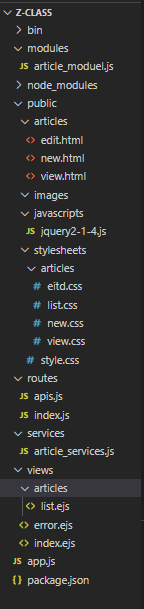

# Node-Mongodb_Operation-The-Acrticle
# 运用node+mongodb+jQuery实现对数据库中文章的增删改查并渲染到页面的前后端分离项目

 - 由于未知原因，拉取的代码总是有一些依赖没有安装，所以建议拉取这个项目时先自己用express-generator自动创建一个本地的项目，再把拉取的业务代码复制到本地中，然后下载mongoose依赖。

## 技术栈：jQuery、node、mongodb、mongoose

业务逻辑：客户端发送请求，服务器查询或修改数据库中的数据，然后将得到的数据响应给客户端渲染。

### 各功能实现逻辑：
 - 文章发布
        
        -客户发送获取文章发布的静态页面请求

        -服务器响应文章发布的静态页面   

        -文章编辑完毕，点击发送按钮发送异步请求

        -服务器调用saveAPI将数据保存到数据库中，如果响应成功，服务器向客户端发送文章发布成功的JSON格式的数据，弹出发布成功并跳转到文章的列表页，否则响应发布失败
		
	----跳转到文章列表页面

		-发送请求获取文章列表的请求

	  	-服务器调用findAPI将保存在数据库中的这个集合下的所有数据响应到客户，客户端拿到数据通过BOM操作跳转并刷新/api/articles的页面
	  	
 - 删除文章

        -客户端通过AJAX发送DELETE请求，如果响应成功，服务器向客户端发送文章删除成功的JSON格式的数据，并且调用findByIdAndRemoveAPI通过id将数据库的文章删除
  	 
 - 查询文章的内容详情

  	    -通过a标签跳转到view.html的空白数据页面，服务器通过客户端请求地址上的id值从数据库查询文章的内容，然后将数据响应给客户端渲染。
  
 - 修改文章

  	    -通过a标签跳转到edit.html的空白数据页面，服务器通过客户端请求地址上的id值从数据库查询文章的内容，然后将数据响应给客户端渲染。

  	    -文章修改完成点击发布时，通过AJAX发送PUT请求，服务器通过findByIdAndUpdate的API将数据库的这篇文章进行修改，然后通过BOM操作跳转并刷新/api/articles的页面。

## 开启MongoDB服务器命令
    net start mongodb

## 关闭MongoDB服务器命令
    net stop mongodb

### 
